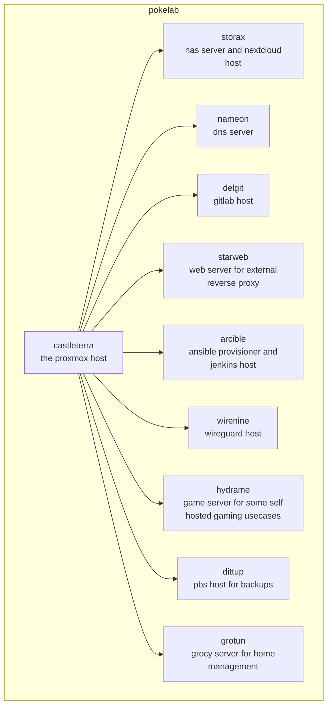
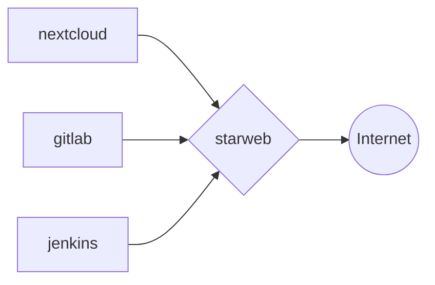
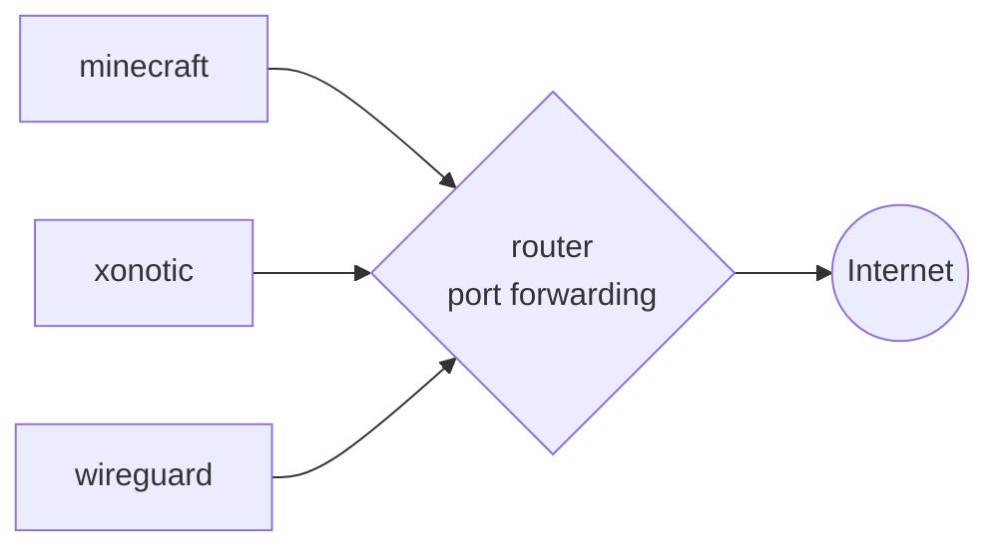
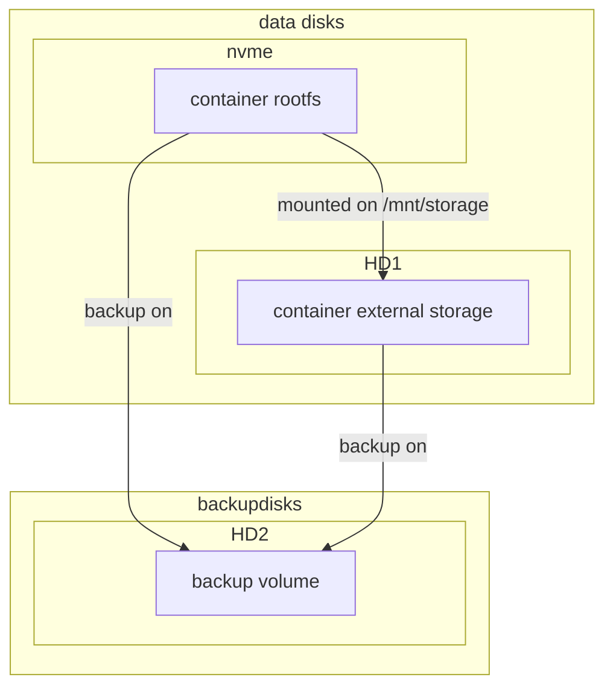
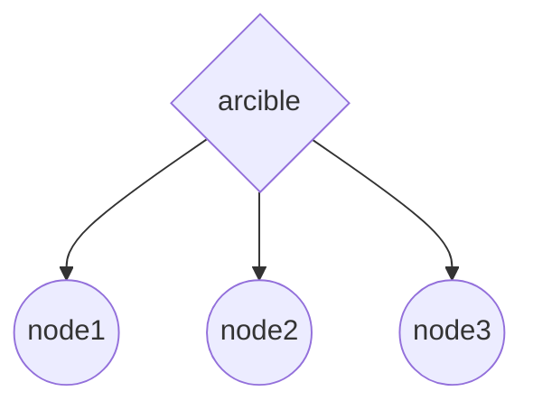

# POKELAB

Personal proxmox cluster for self-hosted services, application deployment environment and playhouse

## HARDWARE

The machine is an old PC with the following specs

| CATEGORY | SPECS                               |
| -------- | ----------------------------------- |
| MEMORY   | 32 GB ram                           |
| STORAGE  | 1 TB nvme ssd, 2 TB hard drives X 2 |
| CPU      | ryzen 5 1600                        |

## ARCHITECTURE

The machine runs proxmox cluster with vm's and container above it

## NETWORKING 

All machines are under the home LAN with static IP assigned, cause the router does not allow to add routes for new subnets :(.

some services are exposed to the internet via HTTPS reverse proxy with nginx 

some other services are exposed through port forwarding on the router

The router has an associated DDNS record `pokelab.ddns.net` and 2 aliases `arcible.ddns.net` and `delgit.ddns.net`

## DISKS MANAGEMENT

Containers and virtual machines's rootfs disk is located in the `local-lvm` volume on the nvme disk and the ones that mount an external volume mounts it under `/mnt/storage`. The external volumes are located on the `main` lvm volume, under one of the hard drives, all the volumes are backuped in the other hard drive from pbs

## BACKUPS 

Backups are made with the use of PBS in snapshot mode, every night at 21:00 for all containers and virtual machines, one of the 2 hard drives is dedicated to this purpose, only the last 5 backups are maintained 

for big containers stop mode is used instead, see [this](https://pve.proxmox.com/wiki/Backup_and_Restore#_backup_modes) for reference

## PROVISIONING

Provisioning of the machines is done with the `arcible` machine, and the repository [labcraft](https://github.com/carnivuth/labcraft),

for specific provisioning procedures refer to [the guide](PROVISIONING_PROCEDURES.md)

## APPLICATION MANAGEMENT

Applications inside containers are located under `/usr/local`, application data are linked in `/mnt/storage` which is mounted inside another more large volume

application that need to run as daemons uses systemd units with custom user and limited read write permissions