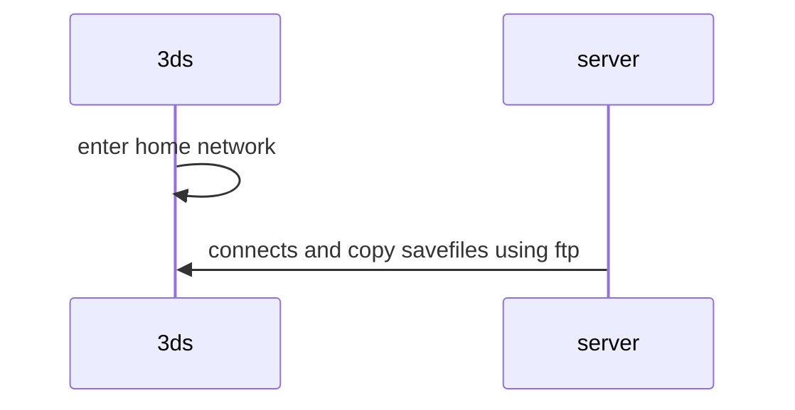

# NINTENDO 3DS DEFINITIVE CONFIGURATION GUIDE

My personal ultimate guide to setup a bullet proof nintendo 3ds emulator machine to take around and don't lose data

## THE PROBLEM

in my daily routine there are often dead moments, mainly travels with pubblic transport (work,university) so i was wandering if i can bring back to life my old 3ds and make it the perfect companion to kill boredom


## STEPS

> the steps are also documented in [my personal homelab project](https://github.com/carnivuth/labcraft/blob/main/playbooks/configure_3ds_backup.yml)

- follow the ultimate guide to [mod 3ds](https://3ds.hacks.guide/)

after modding the 3ds configure network copy the [Universal Updater](https://universal-team.net/projects/universal-updater) cia in the sd and install it

- download `twilight menu` from Universal updater
- download `ftpd` menu from Universal updater
- copy roms on the sd card

```bash
udiskctl mount /dev/sda1
rsync -r ~/Games/roms/* /run/media/$USER/3DS/roms
```

## SETUP SAVES BACKUP

The SD card is **not a reliable memory support**, it will fail taking with it all of the save data (*it's already happened to me :(*), so in order to avoid it the idea is to create an automation to backup data when i come back home without needing to actively run anithing



To setup:

- set static ip in the 3ds configuration (`or DHCP reservation on router`)

configure a container with the following cronjob:

- install ftp

```bash
apt install ftp
```

- write the following script in `/usr/local/bin/backup_3ds.sh`

```bash
#!/bin/bash
PORT=5000
SERVER=192.168.1.28
NDS_DEST=/var/lib/nds_saves; if [[ ! -d "$NDS_DEST" ]]; then mkdir -p "$NDS_DEST"; fi
GBA_DEST=/var/lib/gba_saves; if [[ ! -d "$GBA_DEST" ]]; then mkdir -p "$GBA_DEST"; fi
if nc -z -w1 "$SERVER" "$PORT"; then
    echo "FTP is up."
    ftp -n -p "$SERVER" "$PORT" <<EOF
    binary
    prompt
    lcd "$NDS_DEST"
    cd roms/nds/saves
    mget *
    lcd "$GBA_DEST"
    cd roms/gba/saves
    mget *
EOF
    echo DONE
else
    echo "FTP is down. Will try again."
fi
```

- add cronjob

```bash
* * * * * /usr/local/bin/backup_3ds.sh >> /var/log/backup_3ds.sh 2>&1
```

[PREVIOUS](pages/setups/ARCH_SETUP.md) [NEXT](pages/setups/ANDROID_SETUP.md)
